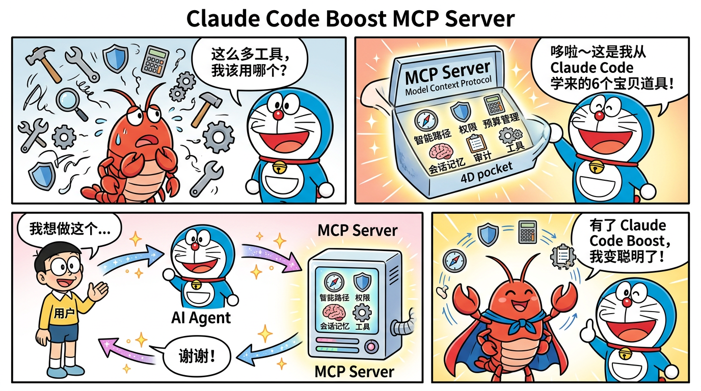
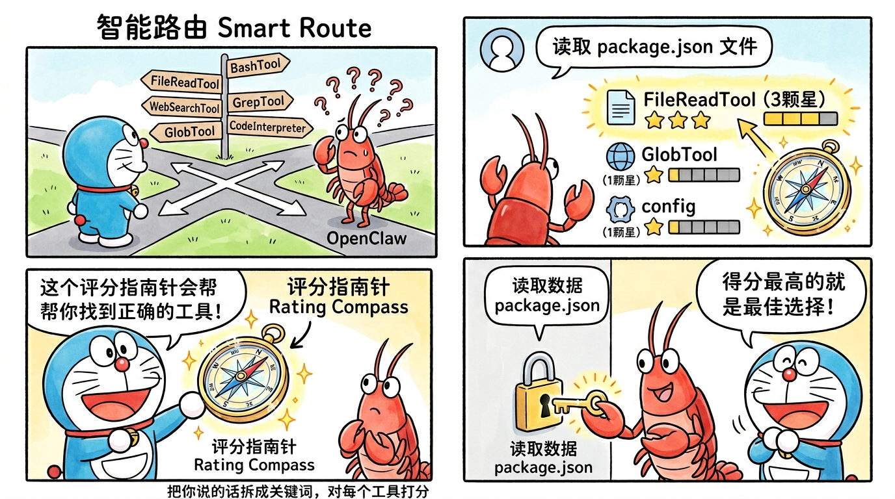
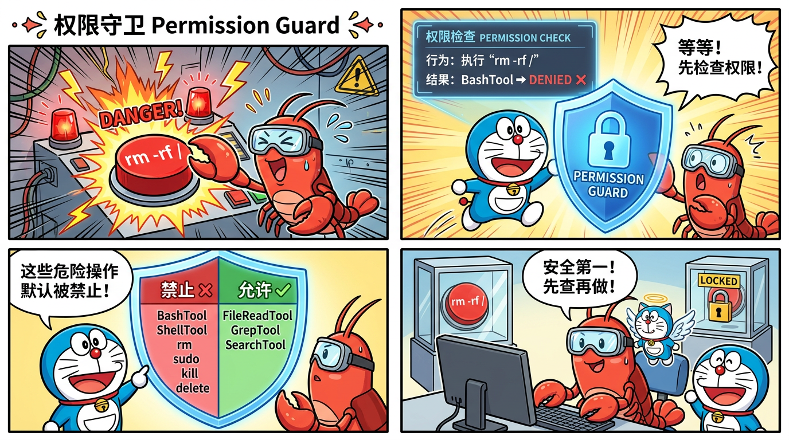
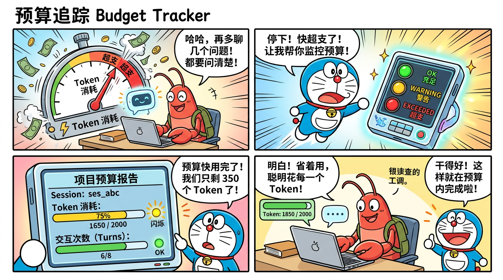
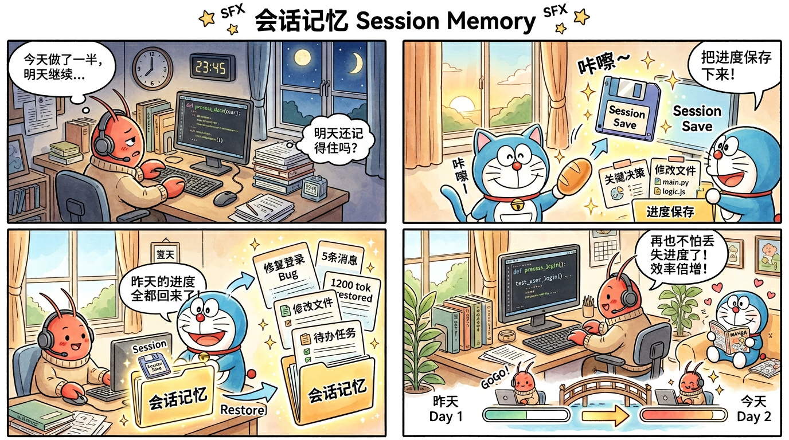
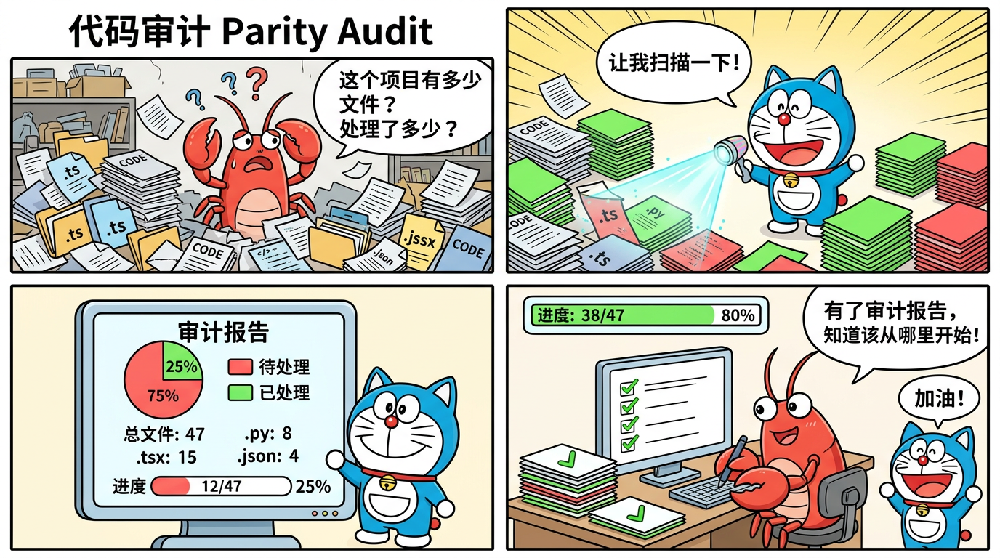

# Claude Code Boost — 用 Claude Code 的智慧武装你的 OpenClaw

> 从 Claude Code 架构源码中提取核心设计模式，打造 MCP Server + Skills 工具包，让你的 OpenClaw（小龙虾）变得更聪明、更安全、更高效。

---

## 这个项目是什么？

**Claude Code Boost** 是一个 OpenClaw 增强工具包。我们研究了 [claw-code](https://github.com/instructkr/claw-code)（Claude Code 架构的社区重写项目），从中提取了 6 个核心设计模式，并将它们封装成：

- **1 个 MCP Server**（提供 6 个工具）—— 赋予 Agent 新能力
- **5 个 OpenClaw Skills**（SKILL.md 格式）—— 教 Agent 更聪明地使用这些能力
- **配置模板** —— 开箱即用的配置文件
- **详细文档** —— 架构解析 + 其他 Agent 使用指南
- **哆啦A梦风格漫画教程** —— 生动形象地讲解每个工具

---

## 漫画图解：一图看懂每个工具

> 以下漫画用哆啦A梦风格，帮助你快速理解每个工具的用途和工作原理。

### MCP Server 整体架构



### 工具详解

| 工具 | 漫画 |
|------|------|
| 智能路由 |  |
| 权限守卫 |  |
| 预算追踪 |  |
| 会话记忆 |  |
| 代码审计 |  |

---

## 能解决什么问题？

| 问题 | Claude Code Boost 方案 | 来源灵感 |
|------|---------------------|----------|
| Agent 不知道用哪个工具 | **智能路由**：评分算法自动匹配最佳工具 | Claude Code `runtime.py` |
| Agent 执行危险操作 | **权限守卫**：执行前自动检查安全策略 | Claude Code `permissions.py` |
| Token 费用失控 | **预算追踪**：实时监控用量，超支自动预警 | Claude Code `query_engine.py` |
| 跨会话丢失进度 | **会话记忆**：保存/恢复工作状态 | Claude Code `session_store.py` |
| 不知道项目处理了多少 | **代码审计**：文件级覆盖率统计 | Claude Code `parity_audit.py` |

---

## 快速开始（5 分钟上手）

### 前置要求

- [Node.js](https://nodejs.org/) >= 18（推荐 22+）
- [OpenClaw](https://docs.openclaw.ai/) 已安装并运行
- 基本的终端操作能力

### 第一步：下载项目

```bash
git clone https://github.com/bcefghj/openclaw-clawcode-boost.git
cd openclaw-clawcode-boost
```

### 第二步：安装并构建 MCP Server

```bash
cd mcp-server
npm install
npm run build
cd ..
```

构建成功后会在 `mcp-server/dist/` 下生成编译后的 JavaScript 文件。

### 第三步：配置 OpenClaw 连接 MCP Server

编辑你的 OpenClaw 配置文件 `~/.openclaw/openclaw.json`（如果文件不存在就创建它）：

```json
{
  "mcpServers": {
    "claude-code-boost": {
      "command": "node",
      "args": ["/你的完整路径/openclaw-clawcode-boost/mcp-server/dist/index.js"],
      "transport": "stdio"
    }
  }
}
```

**注意**：把 `/你的完整路径/` 替换成你实际的项目路径。例如：

```json
"args": ["/home/user/openclaw-clawcode-boost/mcp-server/dist/index.js"]
```

### 第四步：安装 Skills

把 `skills/` 目录下的所有技能复制到 OpenClaw 的技能目录：

```bash
cp -r skills/* ~/.openclaw/workspace/skills/
```

如果 `~/.openclaw/workspace/skills/` 不存在，先创建它：

```bash
mkdir -p ~/.openclaw/workspace/skills/
cp -r skills/* ~/.openclaw/workspace/skills/
```

### 第五步：重启 OpenClaw 并验证

```bash
# 重启 gateway 让配置生效
openclaw gateway restart

# 验证 MCP Server 已连接
openclaw mcp list

# 验证 Skills 已加载
openclaw skills list
```

你应该能看到 `claude-code-boost` 出现在 MCP 列表中，以及 5 个 skills 出现在技能列表中。

### 第六步：测试一下！

和你的 Agent 对话：

```
你：帮我分析一下当前项目的文件结构
```

Agent 会自动使用 `smart_route` 找到最佳工具，使用 `parity_audit` 分析文件结构。

---

## 详细功能说明

### 1. 智能路由 (`smart_route`)

**做什么**：当你给 Agent 一个任务时，它会用评分算法从所有可用的工具和命令中找到最匹配的。

**怎么工作**：
1. 把你的自然语言请求拆分成关键词
2. 用每个关键词去匹配工具的名称、描述和职责
3. 计算每个工具的匹配分数
4. 返回得分最高的工具列表

**示例**：

```
输入 prompt: "读取 package.json 文件"
输出:
  1. [tool] FileReadTool (score: 3) — 读取文件内容
  2. [tool] GlobTool (score: 1) — 查找文件
  3. [command] config (score: 1) — 查看配置
```

**算法来源**：直接移植自 Claude Code 源码的 `runtime.py` 中 `PortRuntime._score()` 方法。

---

### 2. 权限守卫 (`permission_check` + `permission_update`)

**做什么**：在 Agent 执行可能有危险的操作前，先检查是否被允许。

**默认被阻止的操作**：
- `BashTool` — 任意 shell 命令执行
- `ShellTool` — shell 命令执行
- `ExecuteTool` — 程序执行
- `FileDelTool` — 文件删除
- 所有以 `rm`、`delete`、`drop`、`sudo`、`kill` 开头的工具

**示例**：

```
检查 "BashTool":
{
  "toolName": "BashTool",
  "allowed": false,
  "denial": {
    "toolName": "BashTool",
    "reason": "Tool \"BashTool\" is explicitly denied by name"
  }
}
```

如果你确认允许某个操作，可以用 `permission_update` 更新策略。

---

### 3. 预算追踪 (`budget_tracker`)

**做什么**：跟踪每次对话消耗了多少 token，防止费用失控。

**四个操作**：

| 操作 | 说明 |
|------|------|
| `create` | 创建新的预算会话，设置上限 |
| `record` | 记录一次对话消耗的 token |
| `status` | 查看当前预算状态 |
| `reset` | 重置预算计数器 |

**三种状态**：

| 状态 | 含义 |
|------|------|
| `ok` | 预算充足，正常使用 |
| `warning` | 预算即将耗尽（剩余 <20% 或 <=2 轮） |
| `exceeded` | 预算已用完，应停止操作 |

**示例输出**：

```
=== Budget Report ===
Session: ses_abc123
Status:  WARNING

Turns:   6 / 8 (2 remaining)
Tokens:  1650 / 2000 (350 remaining)
  Input:  1100
  Output: 550

⚠ Budget is running low. Consider compacting history or finishing soon.
```

---

### 4. 会话记忆 (`session_manager`)

**做什么**：保存和恢复工作进度，让 Agent 可以跨会话记住之前做了什么。

**三个操作**：

| 操作 | 说明 |
|------|------|
| `save` | 保存当前会话（消息、token用量、元数据） |
| `load` | 加载之前保存的会话 |
| `list` | 列出所有保存的会话 |

**存储位置**：`~/.openclaw/boost-sessions/`

**使用场景**：
- 今天做了一半的代码重构，明天继续
- 切换到另一个项目，稍后回来
- 记录重要的决策和上下文

---

### 5. 代码审计 (`parity_audit`)

**做什么**：扫描一个目录，统计文件数量和类型，计算"覆盖率"（已处理 vs 未处理的文件）。

**示例输出**：

```
=== Parity Audit Report ===
Directory: /home/user/my-project
Total files: 47
Covered: 12 (25%)
Uncovered: 35

File types:
  .ts: 20 files
  .tsx: 15 files
  .py: 8 files
  .json: 4 files

Uncovered files (first 20 of 35):
  - src/auth/login.ts
  - src/auth/register.ts
  ...
```

---

### 6. Skills（5 个智能技能）

Skills 是教 Agent 如何更好地使用上述工具的"说明书"。它们不会消耗额外的 token（只在需要时加载），但能显著提高 Agent 的工作质量。

| 技能 | 教 Agent 什么 |
|------|---------------|
| `smart_task_router` | 如何根据评分选择最佳工具，何时该问用户 |
| `budget_aware_coding` | 如何估算 token 消耗，预算不足时怎么办 |
| `permission_guard` | 执行危险操作前必须检查权限，被阻止时的替代方案 |
| `session_memory` | 什么时候该保存会话，保存哪些内容，怎么恢复 |
| `code_audit_helper` | 如何系统化审计代码，如何追踪进度 |

---

## 项目目录结构

```
openclaw-clawcode-boost/
├── README.md                          # 你正在看的这个文件
├── LICENSE                            # MIT 开源协议
│
├── comics/                            # 哆啦A梦风格漫画教程
│   ├── comic-mcp-overview.png         # MCP 架构总览
│   ├── comic-smart-route.png          # 智能路由
│   ├── comic-permission-guard.png     # 权限守卫
│   ├── comic-budget-tracker.png       # 预算追踪
│   ├── comic-session-memory.png       # 会话记忆
│   └── comic-code-audit.png           # 代码审计
│
├── mcp-server/                        # MCP Server（核心）
│   ├── package.json                   # Node.js 项目配置
│   ├── tsconfig.json                  # TypeScript 编译配置
│   ├── src/                           # 源代码
│   │   ├── index.ts                   # 入口文件，注册所有工具
│   │   ├── tools/
│   │   │   ├── smart-route.ts         # 智能路由工具
│   │   │   ├── permission-check.ts    # 权限检查工具
│   │   │   ├── budget-tracker.ts      # 预算追踪工具
│   │   │   ├── session-manager.ts     # 会话管理工具
│   │   │   └── parity-audit.ts        # 代码审计工具
│   │   └── utils/
│   │       ├── types.ts               # 类型定义
│   │       └── scorer.ts              # 评分算法
│   └── dist/                          # 编译输出（构建后生成）
│
├── skills/                            # OpenClaw Skills
│   ├── smart-task-router/SKILL.md
│   ├── budget-aware-coding/SKILL.md
│   ├── permission-guard/SKILL.md
│   ├── session-memory/SKILL.md
│   └── code-audit-helper/SKILL.md
│
├── templates/                         # 配置模板
│   ├── openclaw.json                  # OpenClaw MCP 配置示例
│   └── project-config.md             # 项目配置文件模板
│
└── docs/                              # 补充文档
    ├── architecture.md                # 架构解析：从 Claude Code 学到了什么
    └── for-other-agents.md            # 其他 AI Agent 如何使用本项目
```

---

## 在其他 AI Agent 中使用

本项目的 MCP Server 遵循标准 MCP 协议，任何支持 MCP 的 AI Agent 都能使用。详见 [docs/for-other-agents.md](docs/for-other-agents.md)。

简要说明：

### Cursor / Windsurf / Cline

在各自的 MCP 配置文件中添加 server 配置即可，格式与 OpenClaw 的 `openclaw.json` 类似。

### 自定义 Agent

如果你在开发自己的 Agent，可以：
1. 通过 MCP 协议连接 Server 获取工具能力
2. 参考 `skills/` 中的 SKILL.md 编写 prompt 指导
3. 参考 `docs/architecture.md` 了解设计理念

---

## 常见问题

### Q: 需要联网吗？

不需要。所有工具都在本地运行，不会向任何外部服务发送数据。

### Q: 支持哪些操作系统？

macOS、Linux、Windows（通过 WSL）都可以。需要 Node.js >= 18。

### Q: 会增加 token 消耗吗？

MCP 工具调用本身会消耗少量 token（每次约 50-100 tokens）。但通过智能路由减少错误调用、通过预算追踪避免超支，总体上反而可能省钱。

### Q: 可以自定义哪些工具被禁止吗？

可以。使用 `permission_update` 工具传入自定义的 `deny_names` 和 `deny_prefixes` 即可。

### Q: 会话数据保存在哪里？

保存在 `~/.openclaw/boost-sessions/` 目录下，每个会话是一个 JSON 文件，你可以随时查看或删除。

### Q: 如何卸载？

1. 从 `~/.openclaw/openclaw.json` 中删除 `claude-code-boost` 配置
2. 从 `~/.openclaw/workspace/skills/` 中删除 5 个 skill 目录
3. 删除 `openclaw-clawcode-boost` 项目目录
4. （可选）删除 `~/.openclaw/boost-sessions/` 目录

---

## 致谢

- [claw-code](https://github.com/instructkr/claw-code) — Claude Code 架构的社区 Python 重写项目，本项目的灵感来源
- [OpenClaw](https://docs.openclaw.ai/) — 开源 AI Agent 框架
- [Model Context Protocol](https://modelcontextprotocol.io/) — Anthropic 开源的工具协议标准

---

## 许可证

MIT License — 自由使用、修改和分发。
