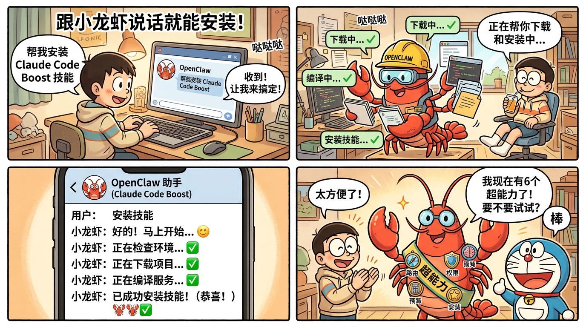
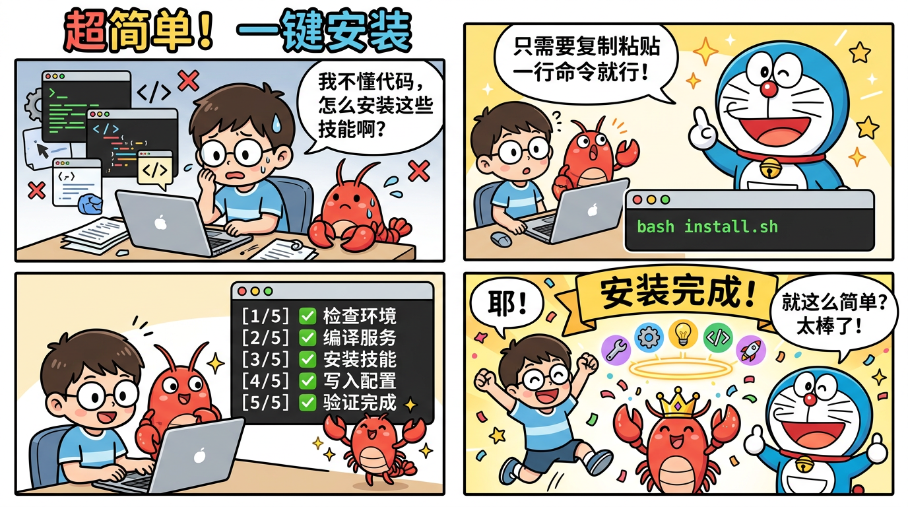
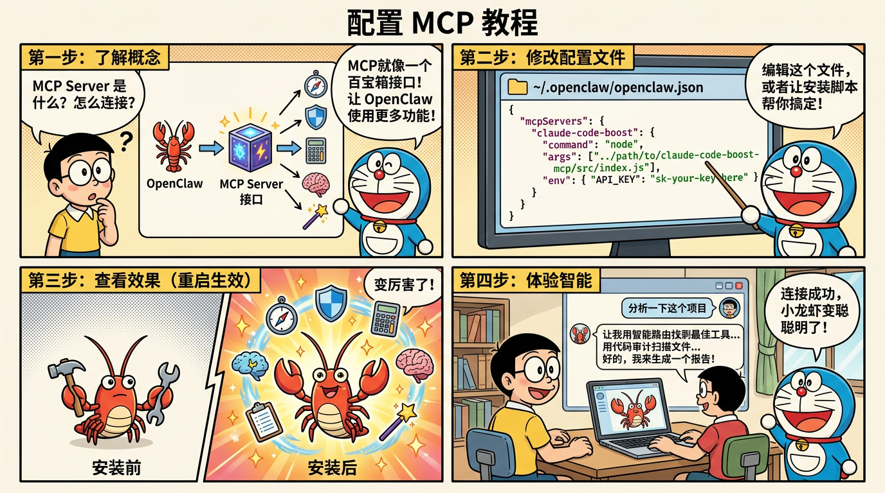

# Claude Code Boost — 让你的 OpenClaw 小龙虾变得更聪明！

> 从 Claude Code 架构源码中提取核心智慧，打造 MCP Server + Skills 工具包。
> 
> **零基础也能用！** 一键安装，或者直接跟小龙虾说"帮我安装"就行。

---

## 看漫画，秒懂这个项目

### 整体架构：小龙虾如何变聪明


### 三种安装方式（选一种就行！）

| 方式 | 适合谁 | 漫画教程 |
|------|--------|----------|
| **方式一**：跟小龙虾说话安装 | 完全零基础 |  |
| **方式二**：一键脚本安装 | 会打开终端的人 |  |
| **方式三**：手动配置 | 想要自定义的人 |  |

---

## 安装方法（选一种就行！）

### 方式一：跟小龙虾说话安装（最简单！）

如果你已经在用 OpenClaw，只需要先把 `auto-installer` 技能放到技能目录：

```bash
mkdir -p ~/.openclaw/workspace/skills/auto-installer
curl -o ~/.openclaw/workspace/skills/auto-installer/SKILL.md https://raw.githubusercontent.com/bcefghj/claude-code-boost/main/skills/auto-installer/SKILL.md
```

然后重启小龙虾，直接对它说：

```
你：帮我安装 Claude Code Boost 技能
```

**小龙虾会自己搞定一切！** 下载、编译、安装、配置，全部自动完成。

---

### 方式二：一键脚本安装（推荐！）

打开终端，粘贴这两行：

```bash
git clone https://github.com/bcefghj/claude-code-boost.git
cd claude-code-boost && bash install.sh
```

就这么简单！脚本会自动完成：
1. 检查你的电脑环境
2. 编译 MCP Server
3. 安装 6 个技能
4. 写好配置文件

安装完成后重启小龙虾就能用了：

```bash
openclaw gateway restart
```

---

### 方式三：手动安装（想要自己动手的）

<details>
<summary>点击展开手动安装步骤</summary>

#### 第一步：下载

```bash
git clone https://github.com/bcefghj/claude-code-boost.git
cd claude-code-boost
```

#### 第二步：编译 MCP Server

```bash
cd mcp-server
npm install
npm run build
cd ..
```

#### 第三步：安装技能

```bash
mkdir -p ~/.openclaw/workspace/skills/
cp -r skills/* ~/.openclaw/workspace/skills/
```

#### 第四步：配置 MCP

编辑 `~/.openclaw/openclaw.json`：

```json
{
  "mcpServers": {
    "claude-code-boost": {
      "command": "node",
      "args": ["/你的路径/claude-code-boost/mcp-server/dist/index.js"],
      "transport": "stdio"
    }
  }
}
```

#### 第五步：重启

```bash
openclaw gateway restart
```

</details>

---

## 安装完能干什么？6 个超能力一览

### 1. 智能路由 — 自动选最佳工具


当你给小龙虾一个任务时，它会用评分算法从所有工具中找到最匹配的。

**例子**：你说"读取 package.json"，它自动选 FileReadTool（3分），而不是乱选。

---

### 2. 权限守卫 — 防止误操作


小龙虾在执行危险操作（如删除文件、执行命令）前，会自动检查权限。

**默认禁止**：`rm`、`delete`、`sudo`、`kill` 等危险操作。

---

### 3. 预算追踪 — 省钱小管家


实时监控每次对话消耗了多少 token，快超支时自动提醒。

**三种状态**：绿灯(充足) → 黄灯(警告) → 红灯(超支)

---

### 4. 会话记忆 — 不再健忘


做了一半的工作可以保存，明天继续。再也不用从头开始。

**就像游戏存档一样！** 保存进度，随时恢复。

---

### 5. 代码审计 — 进度追踪器


扫描项目目录，告诉你有多少文件、处理了多少、还剩多少。

**就像体检报告！** 一眼看清项目健康状况。

---

### 6. 自动安装器 — 小龙虾自己安装技能


直接跟小龙虾说"安装技能"，它会自己下载、编译、安装。

**零代码操作！** 纯对话完成。

---

## 其他 AI Agent 也能用

本项目的 MCP Server 遵循标准协议，不仅限于 OpenClaw：

| Agent | 配置文件位置 |
|-------|------------|
| **Cursor** | `.cursor/mcp.json` 或 `~/.cursor/mcp.json` |
| **Windsurf** | `~/.windsurf/mcp_config.json` |
| **Claude Desktop** | `~/Library/Application Support/Claude/claude_desktop_config.json` |
| **Cline** | Cline 设置面板 → MCP Servers |

配置格式都一样：

```json
{
  "mcpServers": {
    "claude-code-boost": {
      "command": "node",
      "args": ["/你的路径/claude-code-boost/mcp-server/dist/index.js"]
    }
  }
}
```

详见 [docs/for-other-agents.md](docs/for-other-agents.md)。

---

## 项目目录

```
claude-code-boost/
├── install.sh                         # 一键安装脚本（小白专用）
├── README.md                          # 你在看的这个
├── comics/                            # 哆啦A梦风格漫画教程（9张）
├── mcp-server/                        # MCP Server（6个工具）
├── skills/                            # OpenClaw Skills（6个技能）
│   ├── smart-task-router/             # 智能路由
│   ├── budget-aware-coding/           # 预算感知
│   ├── permission-guard/              # 权限守卫
│   ├── session-memory/                # 会话记忆
│   ├── code-audit-helper/             # 代码审计
│   └── auto-installer/               # 自动安装器（小龙虾自己安装！）
├── templates/                         # 配置模板
└── docs/                              # 架构文档 + 其他Agent指南
```

---

## 常见问题

**Q: 需要联网吗？** 不需要，全部本地运行。

**Q: 支持什么系统？** macOS、Linux、Windows(WSL)。需要 Node.js 18+。

**Q: 会多花钱吗？** 每次工具调用约 50-100 tokens，但智能路由减少误操作反而省钱。

**Q: 怎么卸载？** 删除 `~/.openclaw/openclaw.json` 中的配置 + 删除 skills 目录中的技能。

---

## 致谢

- [claw-code](https://github.com/instructkr/claw-code) — Claude Code 架构的社区重写项目，灵感来源
- [OpenClaw](https://docs.openclaw.ai/) — 开源 AI Agent 框架
- [MCP](https://modelcontextprotocol.io/) — Anthropic 开源的工具协议标准

---

MIT License — 自由使用、修改和分发。
